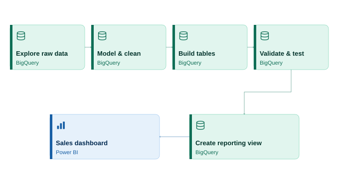
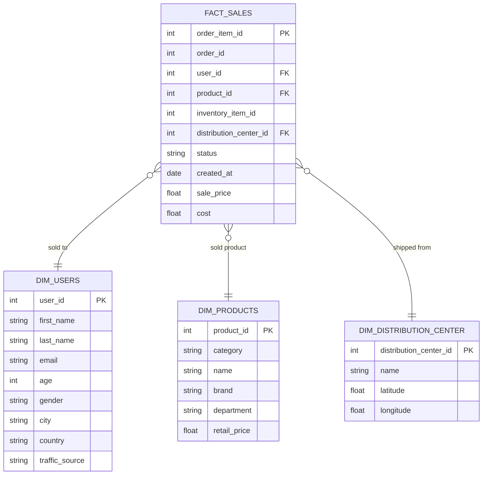
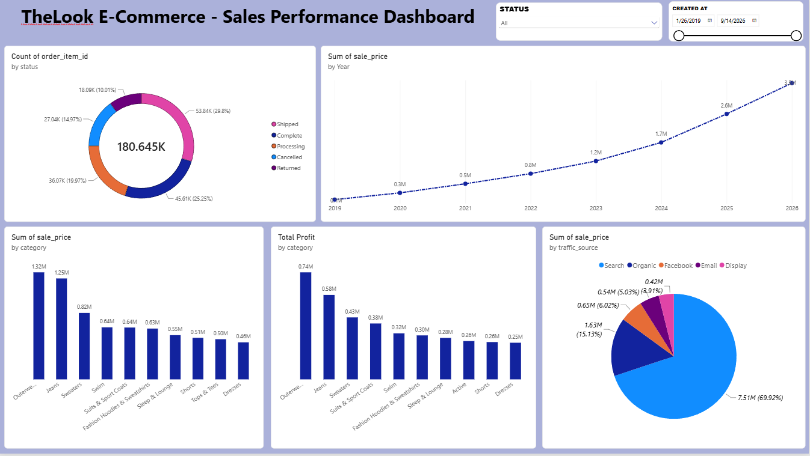
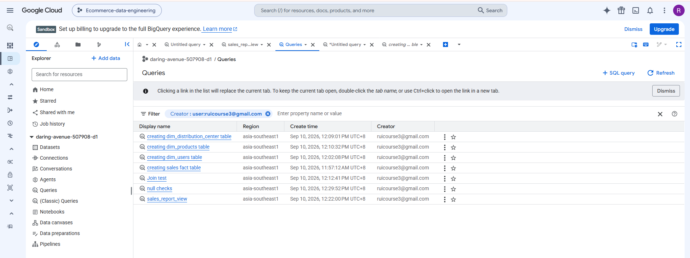
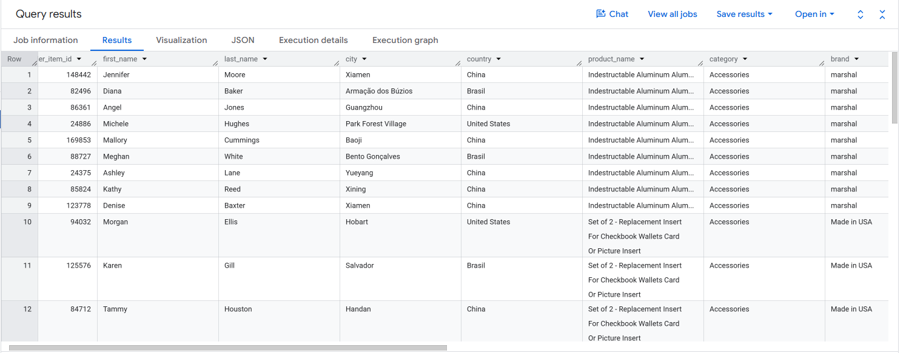
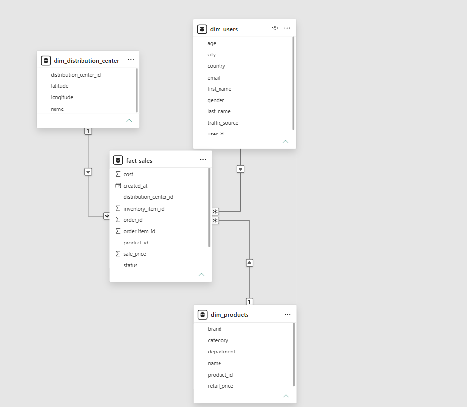

# TheLook E-Commerce - Star Schema & Sales Dashboard



## Overview

This project transforms Google's public `thelook_ecommerce` dataset (hosted on BigQuery) into a star schema data model and builds a sales performance dashboard on top of it. The goal was to practice core analytics engineering skills: dimensional modeling, data cleaning, grain reasoning, and BI dashboard development.

**Data source:** [`bigquery-public-data.thelook_ecommerce`](https://console.cloud.google.com/marketplace/product/bigquery-public-data/thelook-ecommerce) — a public BigQuery dataset simulating a clothing e-commerce business, containing raw tables for users, products, orders, order items, inventory items, distribution centers, and web events.

**Tools used:**
- **Google BigQuery** — data modeling, SQL transformations, table creation
- **Power BI** — dashboard and visualization layer
- **Mermaid** — entity-relationship diagram (rendered below)

---

## Process

### 1. Explored the raw dataset

The public dataset contains seven raw tables: `users`, `products`, `orders`, `order_items`, `inventory_items`, `distribution_centers`, and `events`. Before modeling anything, I reviewed each table's schema in BigQuery (columns, types, nullability) to understand what data was actually available and how tables related to each other through shared ID columns.

### 2. Defined the grain

The most important early decision was choosing the fact table's grain — the level of detail one row represents. I chose **`order_items`** as the base for the fact table, with the grain: **one row per line item sold** (i.e., one product within one order). This was preferred over using `orders` directly, since a single order can contain multiple products, and collapsing to the order level would have made it impossible to analyze sales by individual product.

### 3. Identified dimensions and excluded tables

From the raw tables, three were modeled as dimensions:

- **`users`** → `dim_users` (customer attributes)
- **`products`** → `dim_products` (product attributes)
- **`distribution_centers`** → `dim_distribution_center` (warehouse attributes)

Two raw tables were deliberately **not** modeled as their own dimensions:

- **`inventory_items`** — this table doesn't describe a fixed, independent entity like a customer or product. It represents a specific physical unit of inventory, and its main value for this project was the actual unit `cost`, which was pulled into the fact table via a join rather than modeled as a separate dimension.
- **`events`** — this table represents website clickstream activity (page views, sessions), which is a fundamentally different grain and subject area from sales transactions. It was excluded from this schema and treated as a candidate for a separate, future star schema focused on web behavior analytics.

### 4. Cleaned and trimmed columns

Rather than carrying every raw column forward, each dimension was trimmed to the fields relevant for analysis. For example, `dim_users` excludes `street_address`, `postal_code`, `latitude`, `longitude`, and the derived `user_geom` field, since these added noise and unnecessary PII exposure without supporting the intended business questions.

### 5. Built the fact and dimension tables in BigQuery

Each table was created with a `CREATE OR REPLACE TABLE` statement querying directly from the public dataset. The fact table joins `order_items` to `inventory_items` to pull in `cost` and `distribution_center_id`. Full SQL is included below.

### 6. Validated the model

Before building any dashboard, I validated that the schema actually worked:
- Ran a full join across the fact table and all three dimensions to confirm names, products, and warehouses resolved correctly for each sale.
- Ran null/orphan checks to confirm no fact rows referenced a `user_id` or `product_id` missing from its dimension table.

### 7. Created a flattened reporting view

A `sales_report` view was built joining the fact table to all three dimensions, producing a single flat table for simpler downstream reporting.

### 8. Built the dashboard in Power BI

Connected Power BI Desktop to the BigQuery project via the built-in BigQuery connector, imported the fact and dimension tables (not the flattened view, to preserve and visualize the actual star schema relationships), and built a set of visuals answering specific business questions.

---

## Entity-Relationship Diagram



---

## SQL

### dim_users

```sql
CREATE OR REPLACE TABLE Ecommerce_analytics.dim_users AS
SELECT
  id AS user_id,
  first_name,
  last_name,
  email,
  age,
  gender,
  city,
  country,
  traffic_source
FROM `bigquery-public-data.thelook_ecommerce.users`
```

### dim_products

```sql
CREATE OR REPLACE TABLE Ecommerce_analytics.dim_products AS
SELECT
  id AS product_id,
  category,
  name,
  brand,
  department,
  retail_price
FROM `bigquery-public-data.thelook_ecommerce.products`
```

### dim_distribution_center

```sql
CREATE OR REPLACE TABLE Ecommerce_analytics.dim_distribution_center AS
SELECT
  id AS distribution_center_id,
  name,
  latitude,
  longitude
FROM `bigquery-public-data.thelook_ecommerce.distribution_centers`
```

### fact_sales

```sql
CREATE OR REPLACE TABLE Ecommerce_analytics.fact_sales AS
SELECT
  oi.id AS order_item_id,
  oi.order_id,
  oi.user_id,
  oi.product_id,
  oi.inventory_item_id,
  ii.product_distribution_center_id AS distribution_center_id,
  oi.status,
  oi.created_at,
  oi.sale_price,
  ii.cost
FROM `bigquery-public-data.thelook_ecommerce.order_items` oi
LEFT JOIN `bigquery-public-data.thelook_ecommerce.inventory_items` ii
  ON oi.inventory_item_id = ii.id;
```

### Validation — full join test

```sql
SELECT
  f.order_item_id,
  u.first_name,
  u.last_name,
  p.name AS product_name,
  p.category,
  dc.name AS warehouse,
  f.sale_price,
  f.cost,
  f.sale_price - f.cost AS profit
FROM Ecommerce_analytics.fact_sales f
LEFT JOIN Ecommerce_analytics.dim_users u ON f.user_id = u.user_id
LEFT JOIN Ecommerce_analytics.dim_products p ON f.product_id = p.product_id
LEFT JOIN Ecommerce_analytics.dim_distribution_center dc ON f.distribution_center_id = dc.distribution_center_id
LIMIT 20;
```

### Validation — null / orphan checks

```sql
SELECT COUNT(*) FROM Ecommerce_analytics.fact_sales WHERE user_id IS NULL;

SELECT COUNT(*) FROM Ecommerce_analytics.fact_sales f
LEFT JOIN Ecommerce_analytics.dim_products p ON f.product_id = p.product_id
WHERE p.product_id IS NULL;
```

### Reporting view — sales_report

```sql
CREATE VIEW Ecommerce_analytics.sales_report AS
SELECT
  f.order_item_id,
  u.first_name,
  u.last_name,
  u.city,
  u.country,
  p.name AS product_name,
  p.category,
  p.brand,
  dc.name AS warehouse,
  f.status,
  f.created_at,
  f.sale_price,
  f.cost,
  f.sale_price - f.cost AS profit
FROM Ecommerce_analytics.fact_sales f
LEFT JOIN Ecommerce_analytics.dim_users u ON f.user_id = u.user_id
LEFT JOIN Ecommerce_analytics.dim_products p ON f.product_id = p.product_id
LEFT JOIN Ecommerce_analytics.dim_distribution_center dc ON f.distribution_center_id = dc.distribution_center_id;
```

---

## Dashboard

Built in Power BI, connected live to the BigQuery star schema via Import mode.




### Business questions answered

| Question | Visual |
|---|---|
| Which product categories generate the most revenue? | Bar chart — sum of sale price by category |
| Which categories are actually the most profitable? | Bar chart — total profit by category |
| Where is revenue trending over time? | Line chart — sum of sale price by year |
| Where do our customers come from? | Pie chart — sum of sale price by traffic source |
| What does our order status breakdown look like? | Donut chart — count of order items by status |

### Filters

The dashboard includes slicers for:
- **Created date** (date range)
- **Order status**

---

## Entity Reference

| Table | Type | Grain / Description |
|---|---|---|
| `fact_sales` | Fact | One row per line item sold (one product within one order) |
| `dim_users` | Dimension | One row per customer |
| `dim_products` | Dimension | One row per product |
| `dim_distribution_center` | Dimension | One row per warehouse |

---
## Other screenshots

Bigquery SQL Queries



Bigquery Result Table



PowerBI Model View



---

## Author

Made by Rui Manalo · [LinkedIn](https://www.linkedin.com/in/rui-manalo-71350a376), [Portfolio](https://www.datascienceportfol.io/ruicourse3)


---

## Notes

This project uses BigQuery's free-tier sandbox and Google's public dataset — no billing account charges were incurred. All raw data belongs to Google's `bigquery-public-data` project; transformed tables live in a separate project/dataset created for this exercise.
